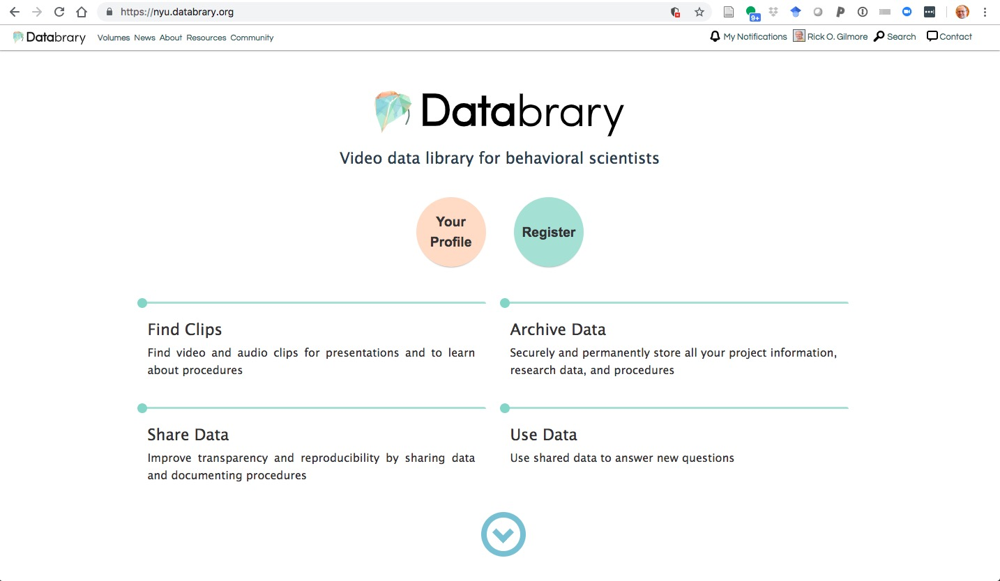
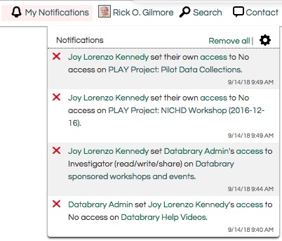

```{r setup, include=FALSE}
knitr::opts_chunk$set(echo = TRUE)
```

# Databrary 1.0

Databrary is a digital data library specialized for storing, sharing, and streaming video and audio with a restricted set of institutionally authorized users based on the sharing release level granted by individual research participants.

# Technology stack

Databrary consists of a database in PostgreSQL, a backend framework in Haskell, and a frontend system in Javascript (AngularJS 1.x).
Most users interact with the system via the browser, but a documented API is available (<https://github.com/databrary/route-doc>) for remote client use (e.g., <https://github.com/PLAY-behaviorome/databraryapi>).
The application is hosted on servers at NYU.
The static documentation site is located on a separate server from the application.
The documentation site is generated via Pelican from Markdown.
All code is shared on GitHub: <http://github.com/databrary>.

# Glossary 

See also <https://www.databrary.org/resources/definitions.html>.

- *Volume* or *Volumes*. Collections of data or materials. Databrary assigns all volumes a volume ID, e.g., <https://nyu.databrary.org/volume/1> and all *shared* volumes are granted unique persistent identifiers (DOIs).
- *Session* or *sessions*. Collections of data within a *volume*. A *session* most often represents a single visit by a participant (or set of participants interacting together) in a study and usually refers to a specific combination of locations, people, and tasks where data was collected.
- *Materials*. Components of a *volume* that are not specific to a particular *session*.
- *Slot* or *slot ID*. An identifier used to access a specific *session* or set of *materials*. *Sessions* and *materials* are indexed by a *slot ID*, e.g., <https://nyu.databrary.org/volume/1/slot/6256/-> refers to *slot* 6256 within volume 1. An example of a *slot* containing *materials* is <https://nyu.databrary.org/volume/2/slot/9819/->. Within the *spreadsheet* for a given *volume*, the *slot* or *slot ID* also refers to a *folder* within which multiple files are stored.
- *Folder*. A container with a *volume ID* and *slot ID* that contains *assets*.
- *Asset* or *assets*. Individual files stored within a (*session* or *materials*) *slot* within a *volume*. The files can be of a fixed variety of specified types as specified here: <https://nyu.databrary.org/asset/formats>. For example, the *asset* at <https://nyu.databrary.org/volume/1/slot/9807/-?asset=1> is a simple video file Databrary's development team uses to test the system and its API.
- *Release levels*. The level of access granted to an *asset* and/or *session* by a research participant. Databrary implments a standard set of *release levels* defined here: <https://www.databrary.org/resources/guide/investigators/release/release-levels.html>. Each release level has a unique icon <https://www.databrary.org/resources/guide/investigators/release/release-levels.html>. Every *session* and every *asset* within a *session* is assigned a *release level* of *private* by default. Different *assets* within the same *session* may have different *release levels*.
- *Affiliate*. An individual, affiliated with an *Authorized Investigator* who operates under that *Authorized Investigator's* sponsorship and supervision. The access privileges of *Affiliates* are under the control of one or more *Authorized Investigators*.
- *Authorized investigator*. An individual who has permission from an *Institution* to conduct independent research, who has received authorization through their *Institution* and from Databrary to view, download, and contribute Data. An employee of an Institution who has the background and training in scientific and administrative oversight necessary to conduct and manage research. Institutions determine who may be eligible to conduct independent research, but this typically includes tenure-track faculty (Instructor through Professor, sometimes Emeritus), research or clinical faculty, and may include archivists, curators, and librarians. Research Associates, Research Assistants, and other staff are not considered to be independent investigators, and therefore are not typically granted permission to conduct independent research.
- *Party* or *party ID*. A person or *institution* who either has access to Databrary or can authorize a person to access Databrary (e.g., an institution). For example, <https://nyu.databrary.org/party/12> shows that Penn State is an institution with a *party ID* 12, while <https://nyu.databrary.org/party/249> shows that Kristin Buss is a person with *party ID* 249.
- *Authorized Organizational Representative (AOR)*. The designated individual who is authorized to sign and enter into contractual agreements on behalf of an *Institution*.
- *Collaborator*. A person with read or read/write privileges on a volume. In the Manage Access tab within the Manage Volume page <https://nyu.databrary.org/volume/VOLUME_ID/edit?page=access>, *Collaborator* refers to any person with access to a volume, not just those with read or read/write access.
- *Investigator*. A person with read/write/share/authorship privileges on a *volume*.
- *Volume privileges* or *privileges*. The actions a user is permitted to take on a given *volume*, these include *read* (view and download *assets*), *read/write* (view, download *assets*, upload or edit *assets*, edit volume *metadata*), and *read/write/share* (view, download *assets*, upload or edit *assets*, edit volume *metadata*, edit access to the *volume* by others, have name included among authors in the bibligraphic citation generated for the volume).

# Pages

## Home/splash page 

Example: <http://nyu.databrary.org>
    
- Buttons to registration page (http://nyu.databrary.org/user/register) and a registered user's profile page (http://nyu.databrary.org/profile)

```{r splash-1, echo=FALSE, fig.align='center', out.width='100%'}

```

- A carousel of video excerpts that link to the source volumes.

```{r splash-2, echo=FALSE, fig.align='center', out.width='100%'}

```

- Summary data about the number of users, institutions, and files generated from <https://nyu.databrary.org/api/activity>

```{r splash-3, echo=FALSE, fig.align='center', out.width='100%'}

```

```{r menu, echo=FALSE, fig.align='center', out.width='100%'}

```

- Menu items
    + **Volumes**. Link to *volumes* search page <https://nyu.databrary.org/search?volume>.
    + **News**. Link to a news page on the static site <https://www.databrary.org/news.html>.
    + **About**. Dropdown menu with links to an about page on the static site <https://www.databrary.org/about.html>
    + **Resources**. Dropdown menu with links to a resources page on the static site <https://www.databrary.org/resources.html>
    + **Community**. Dropdown menu with links to a community page on the static site <https://www.databrary.org/community.html>.
    + **My notifications**. Show logged in user's notifications.
    
```{r notifications, echo=FALSE, fig.align='center', out.width='100%'}

```
   
- Menu items    
    + **Login/register**. Login or register button or dropdown with **View Profile**, **Create Volume**, and **Logout** commands/links.
    
```{r login, echo=FALSE, fig.align='center', out.width='100%'}

```
   
- Menu items
    + **Search**. Link to search page.
    + **Contact**. Link to Contact page on static site.

## Registration page

Example: <http://nyu.databrary.org/register>

- Guides users through the process of registering for access, creating an account and password, and requesting *authorization* from an *institutional* or *individual* *sponsor*.

```{r register, echo=FALSE, fig.align='center', out.width='100%'}

```

- Components
    - **Create Account**. Panel where registrant creates account information (name, email, affiliation).
    - **Get Started**. Panel where registrants can read the *Databrary Access Agreement* and agree to Databrary's three guiding principles.
    - **Confirm Email**.
    - **Set Password**. Panel where the user creates a secure password for Databrary.
    - **Request Authorization**. Panel where the user selects a *sponsor* for authorization. For an *Authorized Investigator*, the *sponsor* is an *institution*. For an *Affiliate*, the *sponsor* is an *Authorized Investigator*.
    - **Submit Authorization**.
    - **Stay Tuned**. Panel informing registrant to wait for more information from Databrary.
	
## Profile page 

Example <http://nyu.databrary.org/profile>

For a user who is logged in, this shows a 'private' page.

```{r profile-private, echo=FALSE, fig.align='center', out.width='100%'}

```
    
- Used by individual users for managing which people have access to what volumes via <https://nyu.databrary.org/party/PARTY_ID/edit?page=grant>.
- Used by individual users to change their password via <https://nyu.databrary.org/party/PARTY_ID/edit?page=account>
- Used by individual users to edit individual user data (name, affiliation, email, ORCID ID, website, avatar/photo) via <https://nyu.databrary.org/party/PARTY_ID/edit?page=profile>
- Used by individual users to edit *notification* settings via <https://nyu.databrary.org/party/PARTY_ID/edit?page=notifications>
- Used by individual users to edit the *parties* who *sponsor* their access via <https://nyu.databrary.org/party/PARTY_ID/edit?page=apply>.
- Used by individual users to create new volumes via <https://nyu.databrary.org/volume/create?owner>.

Viewable by the public at <https://nyu.databrary.org/party/6> along with a list of shared *volumes*.

```{r profile-public, echo=FALSE, fig.align='center', out.width='100%'}

```
    
## Volume page

Example: <https://nyu.databrary.org/volume/1>

```{r volume-1, echo=FALSE, fig.align='center', out.width='100%', fig.cap='Img 1 of 4'}

```

```{r volume-2, echo=FALSE, fig.align='center', out.width='100%', fig.cap='Img 2 of 4'}

```

```{r volume-3, echo=FALSE, fig.align='center', out.width='100%', fig.cap='Img 3 of 4'}

```

```{r volume-4, echo=FALSE, fig.align='center', out.width='100%', fig.cap='Img 4 of 4'}

```

- Components
    + For *collaborators* only, clickable view (eyeball icon) and edit (pencil icon) buttons to switch between (view/edit) modes. A clickable *volume history* button to show the edit history on a volume.
    - **Description of Dataset**. A short narrative description of the dataset, similar to a paper abstract.
    - **Links**. One or more (URL) links to related resources.
    - **How to Cite**. A Databrary-generated citation (in APA format) for the volume, including a DOI.
    - **File Release Levels**. A Databrary-generated table showing what data and materials are shared at what *release levels*. 
    - **Avatar/icon**. An image or still frame from a video. The avatar/icon is drawn from the set of **Highlights**.
    - An icon indicating whether a volume is *private* (locked padlock icon) and thus shared only with specific users, *partially shared* with a volume overview only (keyhole icon), or *shared* (open padlock icon).
    - **Investigators**. The *users* who have *investigator* (read/write/share/authorship) status on the volume.
    - **Collaborators**. The *users* who have *collaborator* (read or read/write) status on the volume.
    - **Highlights**. Images, audio or video recordings that are highlighted and featured on the volume page.
        + Separate audio, video, or image files may be selected.
        + Audio and video files may be played.
    - **Data**
        + **Show saved display mode**. A drop-down menu used to select one of a set of default display modes (NIH Inclusion Enrollment Report or Session release level summary) or a saved custom display mode.
        + **Show summary**. A pivot-table that allows users to create their own tabular summaries of data elements from fields in the spreadsheet.
        + **Filter by**. Interface to filter the displayed results from the *spreadsheet*.
        + **Summarize by**. An interface (via selectable tabs) for choosing how to order the *sessions* and *materials* from the *spreadsheet*. All *spreadsheets* with *sessions* or *materials* can be summarized by *folder*. Only those *spreadsheets* with data about individual participants can be summarized by *participant*. 
        + **Spreadsheet**. Provides data fields for describing *sessions* and *materials*. A *session* or *materials* *slot* is represented by a *folder*. Clicking on a *sessions* or *materials* *folder* icon opens up a *slot* or *folder* view page (see below).
    - **Tags**
        + An interface to add *keywords* or *tags* that describe a volume. These become part of the searchable metadata.
    - **Comments**
        + An interface to add comments about a volume.

## *Slot* or *Session* or *Folder* view page

Example: <https://nyu.databrary.org/volume/1/slot/6256/->

- Components
    + Clickable view (eyeball icon) and edit (pencil icon) buttons to switch between viewing and editing modes. A clickable *session history* button to show the session history. [NB: This functionality may be broken.]
    + A text entry window to add new *keywords* or *tags*. 
    + "Timeline" depictions of metadata information that apply to the *slot*
    + A bar/timeline like depiction of each *asset* (file) in the *slot*
    + A *Viewer* panel appears when the bar/timeline for an *asset* is clicked, for example <https://nyu.databrary.org/volume/1/slot/6256/-?asset=9828>. Video, audio, PDF filetypes (only?) can be viewed here. The *viewer* panel also contains a drag and drop region for uploading new/replacing existing files.
    + A *Comment* box for adding comments specific to a *slot*.
    + A clickable *download all files as zip* text tag.

## Search page

Example: <https://nyu.databrary.org/search>

- Components
    + Free text entry box. "Search"
    + **Volume Filters**. Click boxes, radio buttons, and sliders to select which *volume* and *session* metadata to filter over.
    + **Shared Volumes**. List of *volumes* that match search/filter criteria.
    + **Users**. List of *users* who match search/filter criteria.
- Pages to show all *users* can be generated via <https://nyu.databrary.org/search?offset=0&volume=false>
- Pages to show all institutions with *authorized investigators* can be generated via <https://nyu.databrary.org/search?offset=0&volume=false&f.party_authorization=5&f.party_is_institution=true>.
- Pages to show all *authorized investigators* can be generated via <https://nyu.databrary.org/search?offset=0&volume=false&f.party_authorization=4&f.party_is_institution=false>.
 
# Access model

## Sponsor model

Databrary employs a *sponsor* model, where specific *parties* can grant access privileges to other *parties*.
For example, when an individual institution signs the *Databrary Access Agreement* for the first time, Databrary becomes a sponsor of that institution.
That institution, in turn, becomes a sponsor of a specific *Authorized Investigator* who is employed by and approved by the institution.
Subsequently, *Authorized Investigators* may choose to *sponsor* (grant access privileges to) other *Authorized Investigators* or *Affiliates*.

## Authorized Investigator privileges

*Authorized Investigators* are automatically granted (read/download) access to all *shared* data and materials on Databrary.
*Authorized Investigators* may also create new volumes, read/write/edit/change access to volumes.
On a volume-by-volume basis, *Authorized Investigators* choose who is a *collaborator* (view/read or view/read/write privileges) and who is an *investigator* (view/read/write/authorship/share privileges).
*Authorized Investigators* also choose whether or not each *Affiliate* has (read/download) privileges on Databrary.
