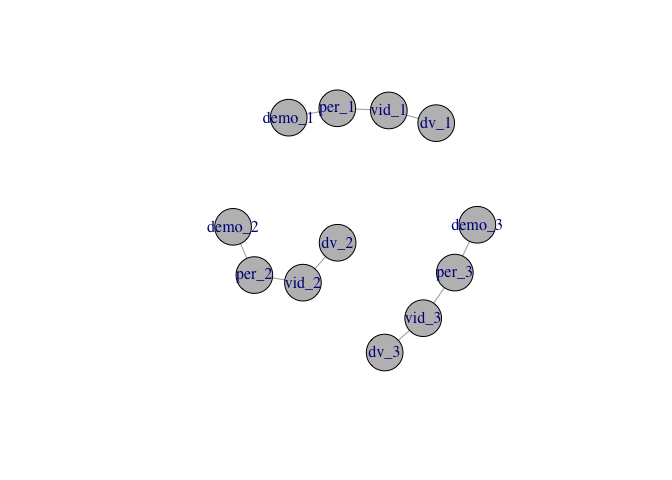
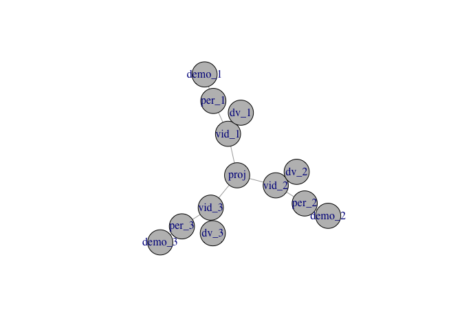
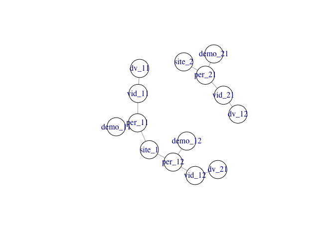
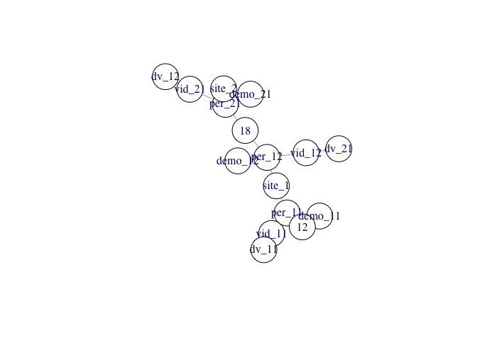
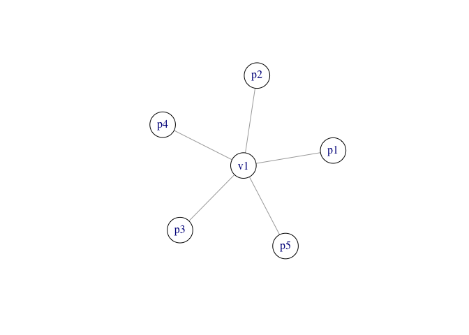
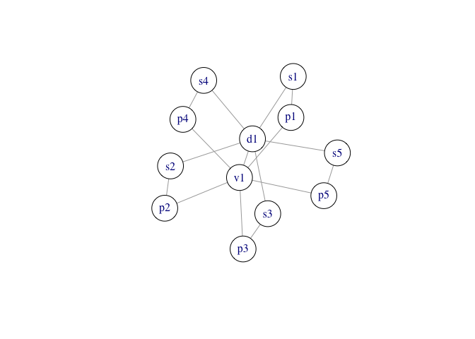
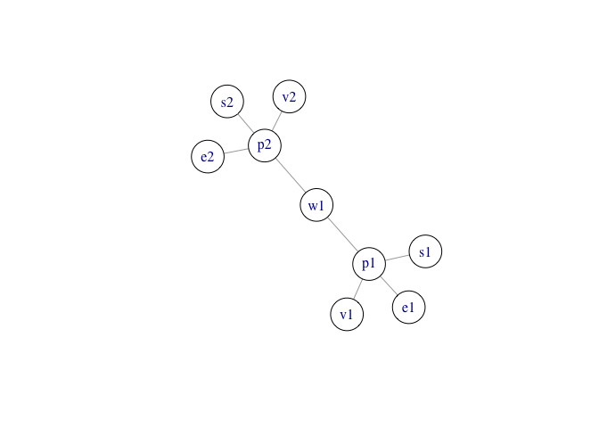

# Purpose

This document contains some work related to planning for the Databrary 2.0 schema.

# Resources

- Ognyanova, K. (2019) Network visualization with R. Retrieved from www.kateto.net/network-visualization. <http://kateto.net/network-visualization>
- ggnet: <https://briatte.github.io/ggnet/>
- DiagrammeR and GraphViz: <https://mikeyharper.uk/flowcharts-in-r-using-diagrammer/>
- Iannone, R. 2018. DiagrammeR: Graph/Network Visualization. https://CRAN.R-project.org/package=DiagrammeR.

## Understanding the network data format

Ognyanova 2019 contains several datasets.
I've downloaded them, and will now import them to understand the basic network data format.


```r
nodes <- read.csv("sunbelt2019/Data files/Dataset1-Media-Example-NODES.csv", header=T, as.is=T)
links <- read.csv("sunbelt2019/Data files/Dataset1-Media-Example-EDGES.csv", header=T, as.is=T)

head(nodes)
```

```
##    id               media media.type type.label audience.size
## 1 s01            NY Times          1  Newspaper            20
## 2 s02     Washington Post          1  Newspaper            25
## 3 s03 Wall Street Journal          1  Newspaper            30
## 4 s04           USA Today          1  Newspaper            32
## 5 s05            LA Times          1  Newspaper            20
## 6 s06       New York Post          1  Newspaper            50
```

```r
head(links)
```

```
##   from  to      type weight
## 1  s01 s02 hyperlink     22
## 2  s01 s03 hyperlink     22
## 3  s01 s04 hyperlink     21
## 4  s01 s15   mention     20
## 5  s02 s01 hyperlink     23
## 6  s02 s03 hyperlink     21
```

# Data collection scenarios

## Separate videos for each participant

Let's visualize a scenario where there is a single video for each participant.


```r
grViz("digraph {
	  style=filled
		color=lightgrey
		node [style=filled, color=lightblue]
    video_1 -> {person_1, datavyu_1}
		video_2 -> {person_2, datavyu_2}
    video_3 -> {person_3, datavyu_3}
    videos -> {video_1, video_2, video_3}
    code_1 -> {datavyu_1, datavyu_2, datavyu_3}
    code_2 -> {datavyu_1, datavyu_2, datavyu_3}
    codes -> {code_1, code_2}
    persons -> {person_1, person_2, person_3}
		}")
```

<!--html_preserve--><div id="htmlwidget-d446365f7417ce5bd952" style="width:672px;height:480px;" class="grViz html-widget"></div>
<script type="application/json" data-for="htmlwidget-d446365f7417ce5bd952">{"x":{"diagram":"digraph {\n\t  style=filled\n\t\tcolor=lightgrey\n\t\tnode [style=filled, color=lightblue]\n    video_1 -> {person_1, datavyu_1}\n\t\tvideo_2 -> {person_2, datavyu_2}\n    video_3 -> {person_3, datavyu_3}\n    videos -> {video_1, video_2, video_3}\n    code_1 -> {datavyu_1, datavyu_2, datavyu_3}\n    code_2 -> {datavyu_1, datavyu_2, datavyu_3}\n    codes -> {code_1, code_2}\n    persons -> {person_1, person_2, person_3}\n\t\t}","config":{"engine":"dot","options":null}},"evals":[],"jsHooks":[]}</script><!--/html_preserve-->

The `igraph` package seems to be more flexible, and it is still supported.
So, let's try a version using it.


```r
library(igraph)
```

```
## 
## Attaching package: 'igraph'
```

```
## The following objects are masked from 'package:stats':
## 
##     decompose, spectrum
```

```
## The following object is masked from 'package:base':
## 
##     union
```

```r
el <- rbind(c("vid_1","per_1"), c("vid_2","per_2"), c("vid_3","per_3"), c("vids", "vid_1"), c("vids", "vid_2"), c("vids", "vid_3"))
g0 <- graph_from_edgelist(el)
#g0$layout <- layout_in_circle
# l <- layout_with_fr(g0)
# l <- layout_on_grid(g0)
l <- layout_nicely(g0)
plot(g0, vertex.size=40, vertex.color="gray", layout = l)
```

<!-- -->

Ok, so now let's add individual Datavyu and demographic data files to this.


```r
el2 <- rbind(el, c("vid_1", "dv_1"), c("vid_2", "dv_2"), c("vid_3", "dv_3"))
g2 <- graph_from_edgelist(el2)
l <- layout_nicely(g2)
plot(g2, vertex.size=40, vertex.color="gray", layout = l)
```

<!-- -->

Let's now add some codes that are contained within the Datavyu files.


```r
el3 <- rbind(el2, c("dv_1", "c_1"), c("dv_2", "c_1"), c("dv_3", "c_1"))
g3 <- graph_from_edgelist(el3)
l <- layout_nicely(g3)
plot(g3, vertex.size=30, vertex.color="gray", layout = l)
```

<!-- -->

Let's next try to do this using a data frame, and adding demographic data `demo_*`.


```r
edges <- data.frame(from = c("vid_1", "vid_2", "vid_3", "vid_1", "vid_2", "vid_3", "per_1", "per_2", "per_3"), to=c("per_1", "per_2", "per_3", "dv_1", "dv_2", "dv_3", "demo_1", "demo_2", "demo_3"), weight= c(1, 1, 1, 1, 1, 1, 1, 1, 1))
g <- graph_from_data_frame(edges, directed = FALSE)
plot(g, vertex.size=30, vertex.color="gray")
```

<!-- -->

A project links these nodes together.
A project could consist of a single 'wave'.


```r
edges <- data.frame(from = c("vid_1", "vid_2", "vid_3", "vid_1", "vid_2", "vid_3", "per_1", "per_2", "per_3", "proj", "proj", "proj"), to=c("per_1", "per_2", "per_3", "dv_1", "dv_2", "dv_3", "demo_1", "demo_2", "demo_3", "vid_1", "vid_2", "vid_3"), weight= c(1, 1, 1, 1, 1, 1, 1, 1, 1, 1, 1, 1))
g <- graph_from_data_frame(edges, directed = FALSE)
plot(g, vertex.size=30, vertex.color="gray")
```

<!-- -->

Or maybe the more natural organization would be at the person level.


```r
edges <- data.frame(from = c("vid_1", "vid_2", "vid_3", "vid_1", "vid_2", "vid_3", "per_1", "per_2", "per_3", "proj", "proj", "proj"), to=c("per_1", "per_2", "per_3", "dv_1", "dv_2", "dv_3", "demo_1", "demo_2", "demo_3", "per_1", "per_2", "per_3"), weight= c(1, 1, 1, 1, 1, 1, 1, 1, 1, 1, 1, 1))
g <- graph_from_data_frame(edges, directed = FALSE)
plot(g, vertex.size=30, vertex.color="gray")
```

<!-- -->

## Sample organization for PLAY

Let's try two sites and have indices (subscripts) representing the site and participant number, respectively.


```r
edges <- data.frame(from = c("vid_11", "vid_12", "vid_21", "vid_11", "vid_21", "vid_12", "per_11", "per_12", "per_21", "site_1", "site_1", "site_2"), to=c("per_11", "per_12", "per_21", "dv_11", "dv_12", "dv_21", "demo_11", "demo_12", "demo_21", "per_11", "per_12", "per_21"), weight= c(1, 1, 1, 1, 1, 1, 1, 1, 1, 1, 1, 1))
g <- graph_from_data_frame(edges, directed = FALSE)
plot(g, vertex.size=30, vertex.color="white")
```

<!-- -->

We could also add an age group node.


```r
edges <- data.frame(from = c("vid_11", "vid_12", "vid_21", "vid_11", "vid_21", "vid_12", "per_11", "per_12", "per_21", "site_1", "site_1", "site_2", "per_11", "per_12", "per_21"), to=c("per_11", "per_12", "per_21", "dv_11", "dv_12", "dv_21", "demo_11", "demo_12", "demo_21", "per_11", "per_12", "per_21", "12", "18", "18"), weight= c(1, 1, 1, 1, 1, 1, 1, 1, 1, 1, 1, 1, 1, 1, 1))
g <- graph_from_data_frame(edges, directed = FALSE)
plot(g, vertex.size=30, vertex.color="white")
```

<!-- -->

This hard-to-read graph gathers age groups across sites.

Let's try some other scenarios.

## One video, multiple people


```r
edges <- data.frame(from = c("v1", "v1", "v1", "v1", "v1"), to=c("p1", "p2", "p3", "p4", "p5"))
g <- graph_from_data_frame(edges, directed = FALSE)
plot(g, vertex.size=30, vertex.color="white")
```

<!-- -->

Let's now add one Datavyu file linked to the video.


```r
edges <- data.frame(from = c("v1", "v1", "v1", "v1", "v1", "v1"), to=c("p1", "p2", "p3", "p4", "p5", "d1"))
g <- graph_from_data_frame(edges, directed = FALSE)
plot(g, vertex.size=30, vertex.color="white")
```

<!-- -->

And now link the Datavyu file (or really segments) to the people.


```r
edges <- data.frame(from = c("v1", "v1", "v1", "v1", "v1", "v1", "d1", "d1", "d1", "d1", "d1", "s1", "s2", "s3", "s4", "s5"), to=c("p1", "p2", "p3", "p4", "p5", "d1", "s1", "s2", "s3", "s4", "s5", "p1", "p2", "p3", "p4", "p5"))
g <- graph_from_data_frame(edges, directed = FALSE)
plot(g, vertex.size=30, vertex.color="white")
```

<!-- -->

## One project, multiple measures per person

Imagine that there are video recordings, a survey, and EEG all collected as part of Wave 1 (`w1`).


```r
edges <- data.frame(from = c("p1", "p2", "p1", "p2", "p1", "p2", "p1", "p2"), to = c("v1", "v2", "s1", "s2", "e1", "e2", "w1", "w1"))
g <- graph_from_data_frame(edges, directed = FALSE)
plot(g, vertex.size=30, vertex.color="white")
```

<!-- -->

Here, the actual assets might be the survey file, the video, and the EEG file.
There is likely to be data associated with the participants and the wave, but that may not need to be stored as specific asset files.

## PLAY organization, version 2

On PLAY, there are data collection sites and data coding sites.
Data collection sites gather at least 3 videos: 1 hour natural behavior, surveys, house tour.
Data collection sites also generate a survey file (with subcomponents), and a decibel reading file.


```r
vertices_p <- readr::read_csv("csv/PLAY-nodes.csv")
```

```
## Parsed with column specification:
## cols(
##   id = col_character(),
##   type = col_character(),
##   label.color = col_character()
## )
```

```r
edges_p <- readr::read_csv("csv/PLAY-edges.csv")
```

```
## Parsed with column specification:
## cols(
##   from = col_character(),
##   to = col_character(),
##   weight = col_double()
## )
```

```r
g <- igraph::graph_from_data_frame(edges_p, vertices_p, 
                                    directed = TRUE)

set.seed(3)
plot(g, vertex.size = 60, label.cex = .5, vertex.shape = "none")
```

<!-- -->

## PLAY organization, version 3

`igraph` is powerful, but requires lots of parameter customization.
Let's try the same thing using `DiagrammeR`.


```r
DiagrammeR::grViz("digraph {

graph [layout = dot, rankdir = LR]

# define the global styles of the nodes. We can override these in box if we wish
node [shape = rectangle, style = filled, fillcolor = Linen]

data1 [label = '1 hr', shape = folder, fillcolor = Beige]
data2 [label = 'Questionnaire video', shape = folder, fillcolor = Beige]
data3 [label = 'Questionnaire file', shape = folder, fillcolor = Beige]
data4 [label = 'House tour', shape = folder, fillcolor = Beige]
data5 [label = 'dB measure', shape = folder, fillcolor = Beige]
visit [label =  'Home visit']
databrary [label = 'Databrary']
kobotb    [label = 'KoBoToolbox']
box [label = 'Box.com']
PLAY [label= 'Play\nstaff']

# edge definitions with the node IDs
{data1 data2 data3 data4 data5}  -> visit -> {databrary, kobotb} -> box -> PLAY
}")
```

<!--html_preserve--><div id="htmlwidget-bd85948702198033d73c" style="width:672px;height:480px;" class="grViz html-widget"></div>
<script type="application/json" data-for="htmlwidget-bd85948702198033d73c">{"x":{"diagram":"digraph {\n\ngraph [layout = dot, rankdir = LR]\n\n# define the global styles of the nodes. We can override these in box if we wish\nnode [shape = rectangle, style = filled, fillcolor = Linen]\n\ndata1 [label = \"1 hr\", shape = folder, fillcolor = Beige]\ndata2 [label = \"Questionnaire video\", shape = folder, fillcolor = Beige]\ndata3 [label = \"Questionnaire file\", shape = folder, fillcolor = Beige]\ndata4 [label = \"House tour\", shape = folder, fillcolor = Beige]\ndata5 [label = \"dB measure\", shape = folder, fillcolor = Beige]\nvisit [label =  \"Home visit\"]\ndatabrary [label = \"Databrary\"]\nkobotb    [label = \"KoBoToolbox\"]\nbox [label = \"Box.com\"]\nPLAY [label= \"Play\nstaff\"]\n\n# edge definitions with the node IDs\n{data1 data2 data3 data4 data5}  -> visit -> {databrary, kobotb} -> box -> PLAY\n}","config":{"engine":"dot","options":null}},"evals":[],"jsHooks":[]}</script><!--/html_preserve-->

Or, another version, dropping the `Home visit` label.


```r
DiagrammeR::grViz("digraph {

graph [layout = dot, rankdir = LR]

# define the global styles of the nodes. We can override these in box if we wish
node [shape = rectangle, style = filled, fillcolor = Linen]

one_hr [label = '1 hr', shape = folder, fillcolor = Beige]
tour [label = 'House\ntour', shape = folder, fillcolor = Beige]
quest_vid [label = 'Questionnaire\nvideo', shape = folder, fillcolor = Beige]
quest_dat [label = 'Questionnaire\nfile', shape = folder, fillcolor = Beige]
db [label = 'db measure', shape = folder, fillcolor = Beige]
tablet [label = 'Tablet']
lab_pc [label = 'Lab PC']
camera [label = 'camera']
databrary [label = 'Databrary' fillcolor = White]
kobotb    [label = 'KoBoToolbox' fillcolor = White]
box [label = 'Box.com' fillcolor = White]
PLAY [label= 'PLAY\nstaff']

# edge definitions with the node IDs
{one_hr quest_vid tour} -> camera -> databrary -> box -> PLAY
quest_dat -> tablet -> kobotb -> box
db -> tablet -> lab_pc -> kobotb
}")
```

<!--html_preserve--><div id="htmlwidget-ac2825f47fc0bccb15cc" style="width:672px;height:480px;" class="grViz html-widget"></div>
<script type="application/json" data-for="htmlwidget-ac2825f47fc0bccb15cc">{"x":{"diagram":"digraph {\n\ngraph [layout = dot, rankdir = LR]\n\n# define the global styles of the nodes. We can override these in box if we wish\nnode [shape = rectangle, style = filled, fillcolor = Linen]\n\none_hr [label = \"1 hr\", shape = folder, fillcolor = Beige]\ntour [label = \"House\ntour\", shape = folder, fillcolor = Beige]\nquest_vid [label = \"Questionnaire\nvideo\", shape = folder, fillcolor = Beige]\nquest_dat [label = \"Questionnaire\nfile\", shape = folder, fillcolor = Beige]\ndb [label = \"db measure\", shape = folder, fillcolor = Beige]\ntablet [label = \"Tablet\"]\nlab_pc [label = \"Lab PC\"]\ncamera [label = \"camera\"]\ndatabrary [label = \"Databrary\" fillcolor = White]\nkobotb    [label = \"KoBoToolbox\" fillcolor = White]\nbox [label = \"Box.com\" fillcolor = White]\nPLAY [label= \"PLAY\nstaff\"]\n\n# edge definitions with the node IDs\n{one_hr quest_vid tour} -> camera -> databrary -> box -> PLAY\nquest_dat -> tablet -> kobotb -> box\ndb -> tablet -> lab_pc -> kobotb\n}","config":{"engine":"dot","options":null}},"evals":[],"jsHooks":[]}</script><!--/html_preserve-->
